# IT-Company-Task-Manager

Best task manager for you

## Check it out!

[IT-Company-Task-Manager deployed to Render](https://it-company-task-manager-b4pe.onrender.com)

## Installation

 Python3 must be already installed

 ```shell

 git clone https://github.com/MaybeTI/IT-Company-Task-Manager.git
 python -m venv venv
 venv\Scripts\activate (on Windows)
 source venv/bin/activate (on macOS)
 pip install -r requirements.txt
 python manage.py loaddata task_manager_db_data.json
 python manage.py runserver
 ```


DB structure
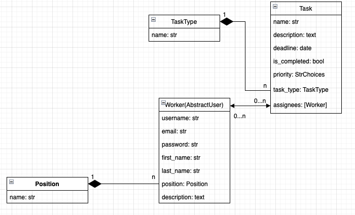

1. Login page:
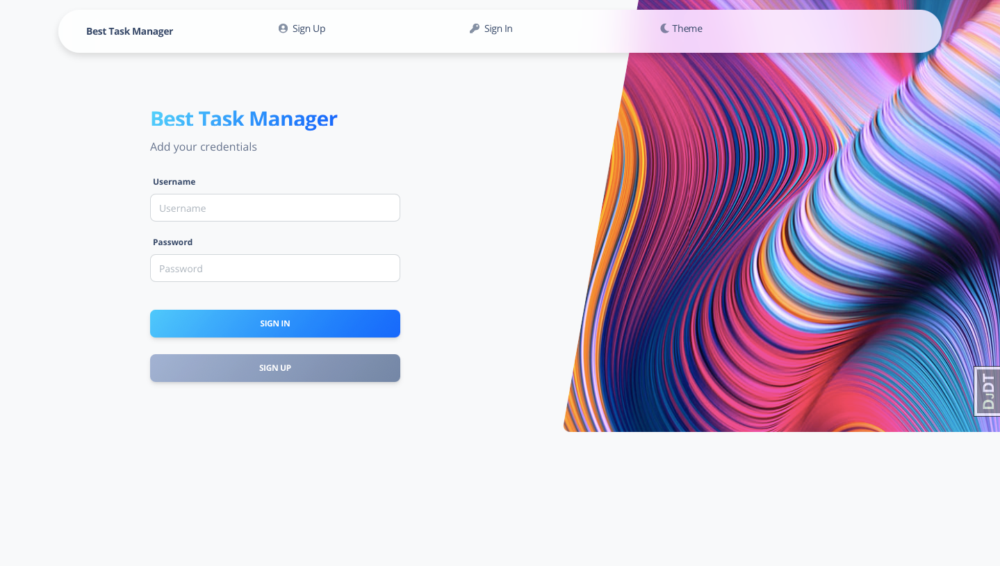
2. Registration page:
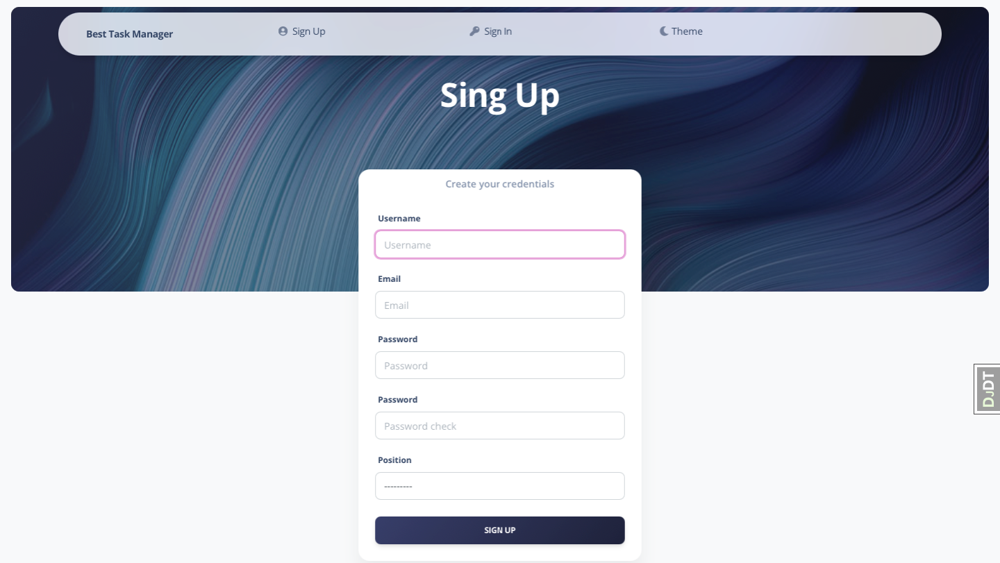
3. Home page:
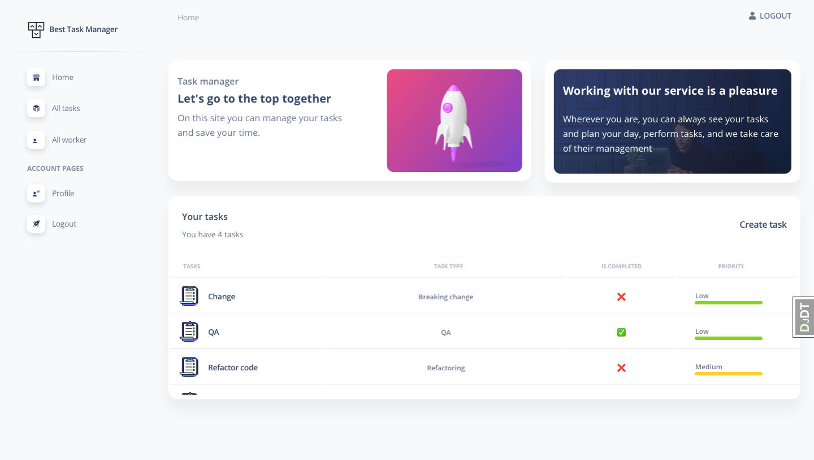
4. All tasks page:
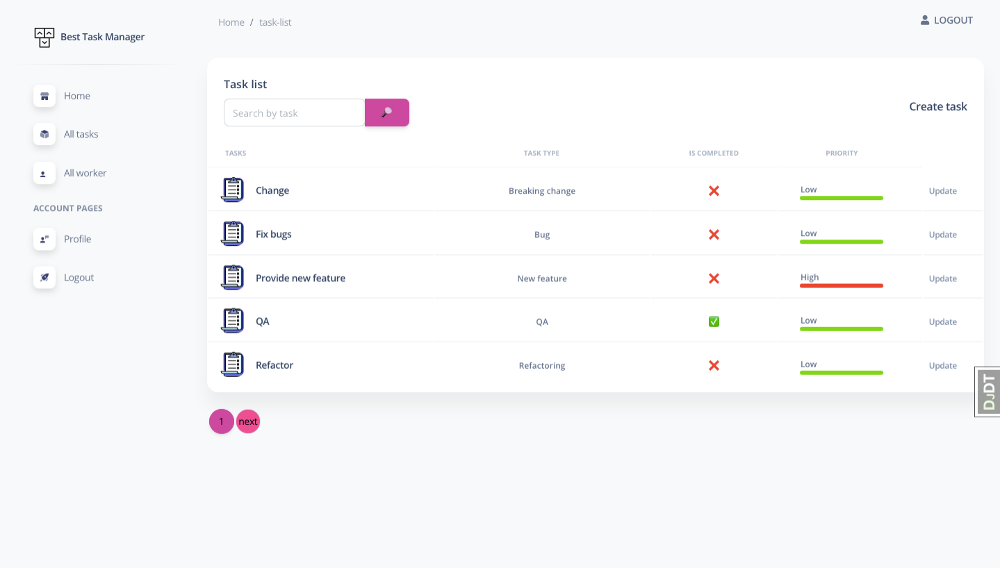
5. All tasks search page:
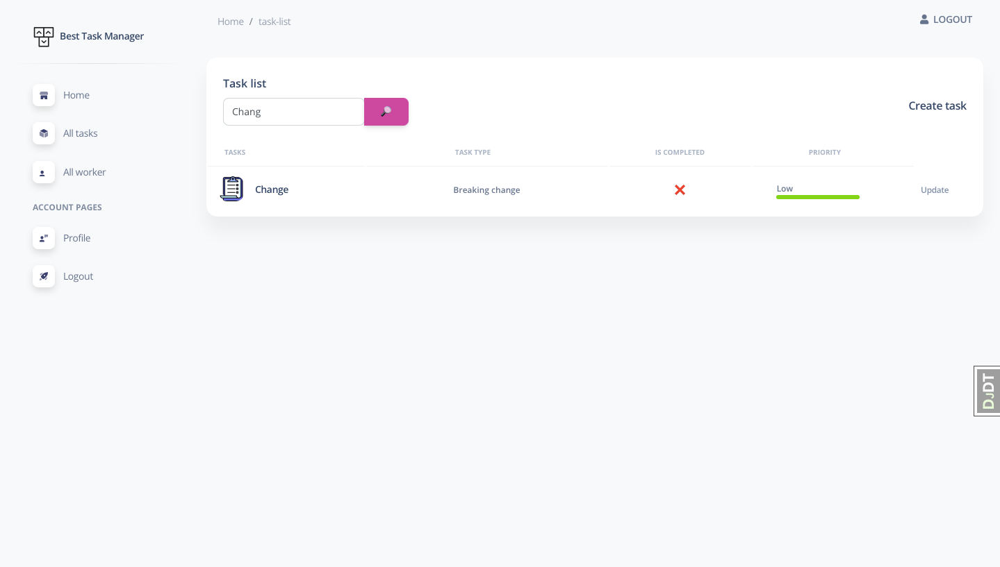
6. Task create page:

7. Task detail page:

8. Page with the addition of workers:
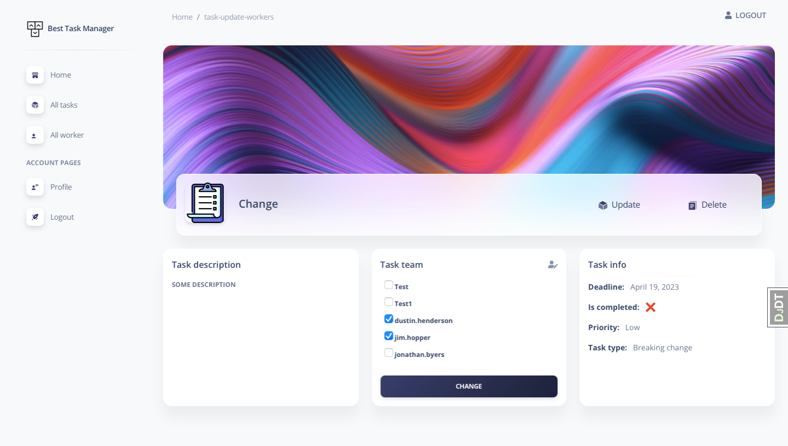
9. Page for update task:
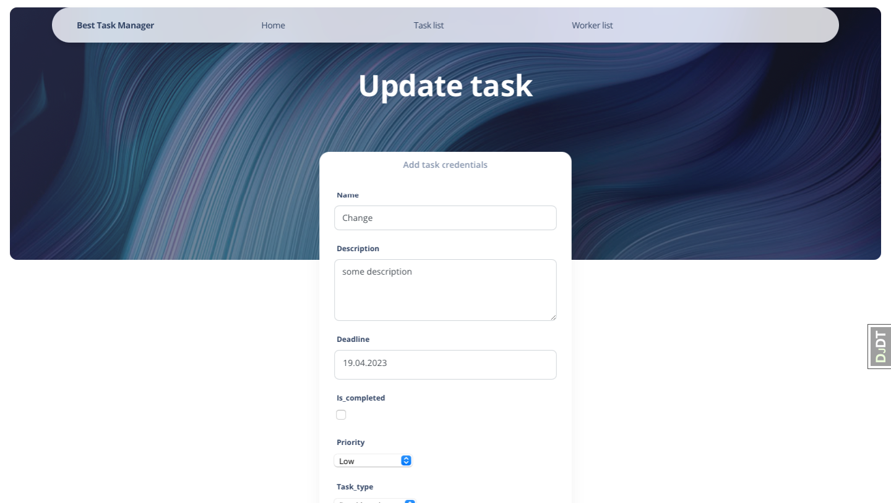
10. Page for confirm delete task:
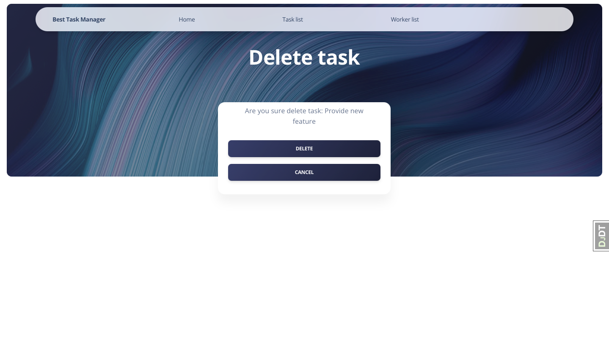
11. All workers page:

12. All workers search page:
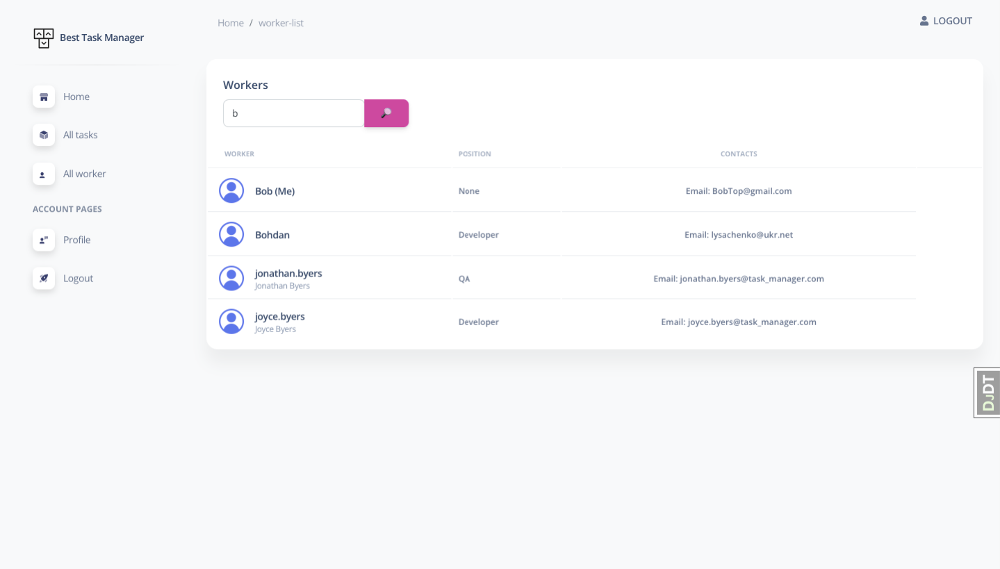
13. Detailed page about the worker:

14. The worker detail page, if this is your account:
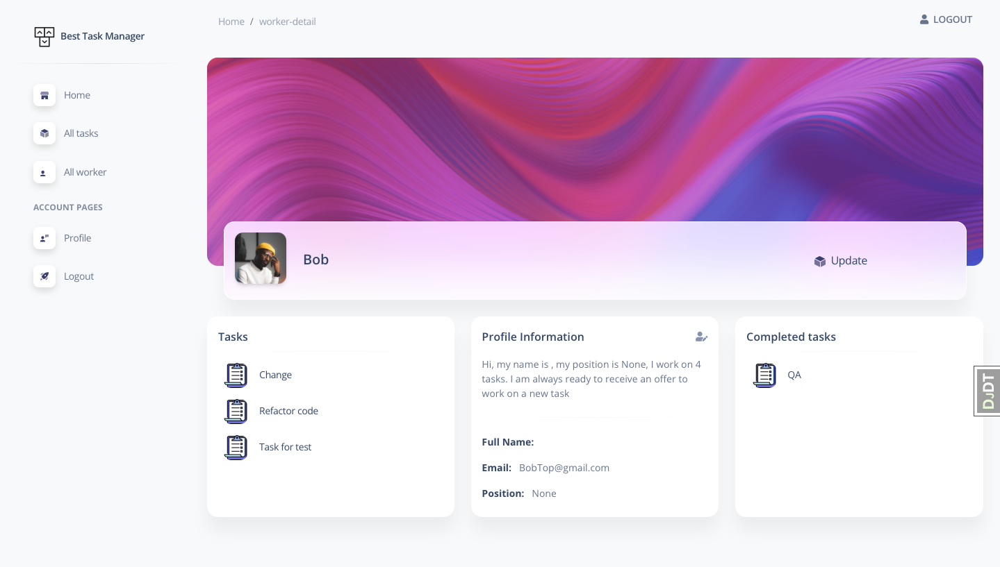
15. The worker detail page when the description changes:
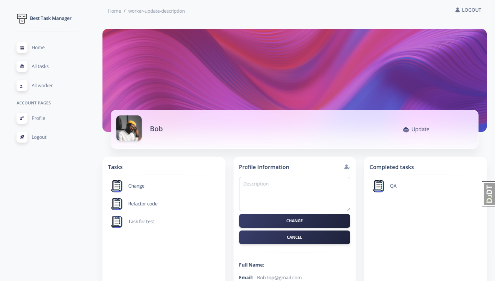
16. Worker update page:
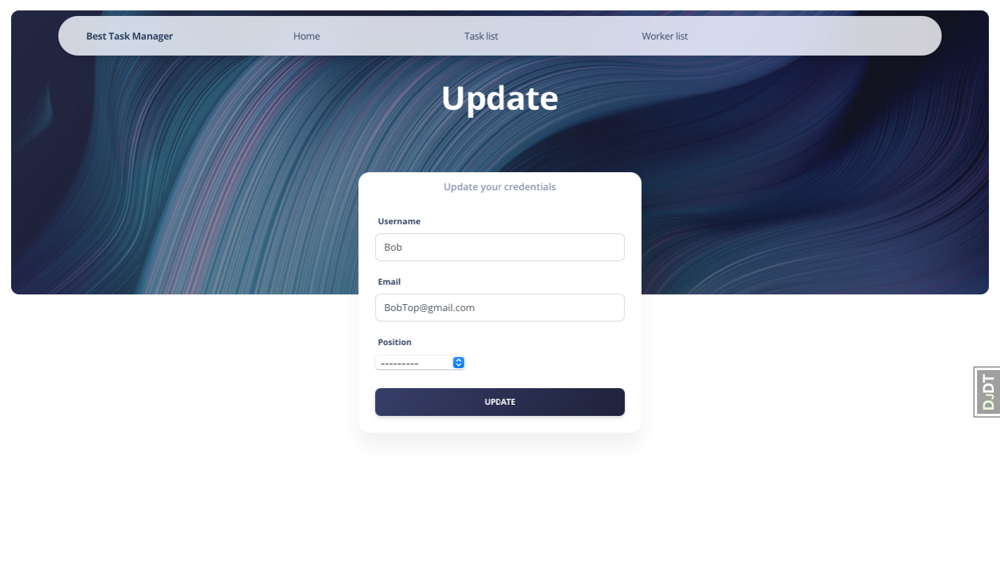
17. Profile page:
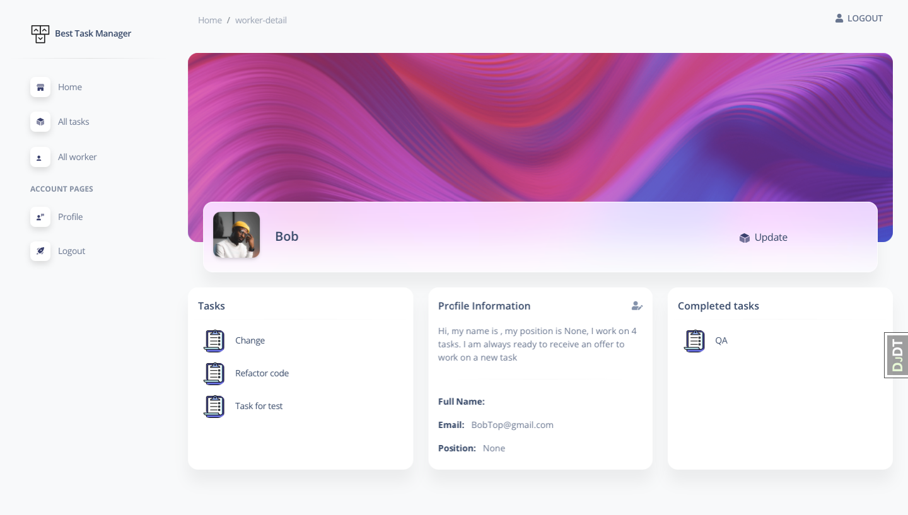